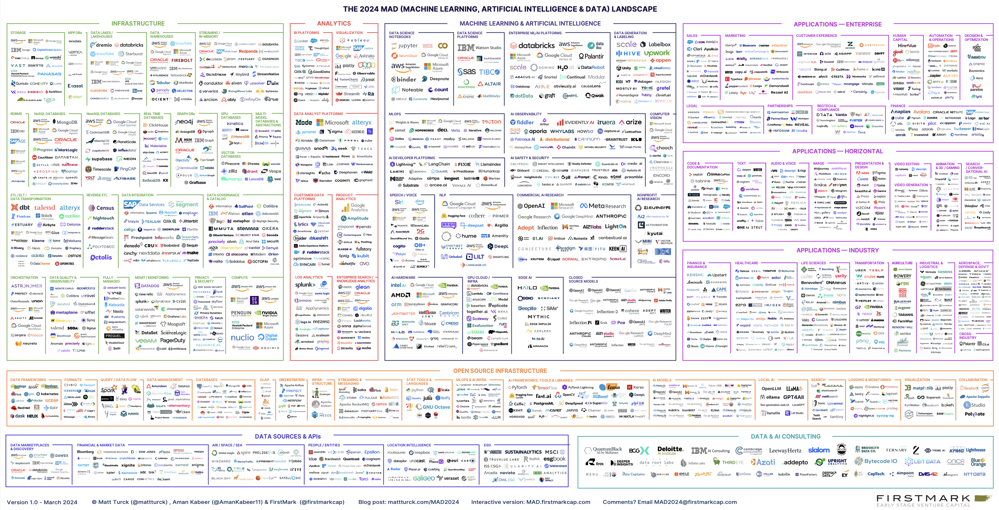
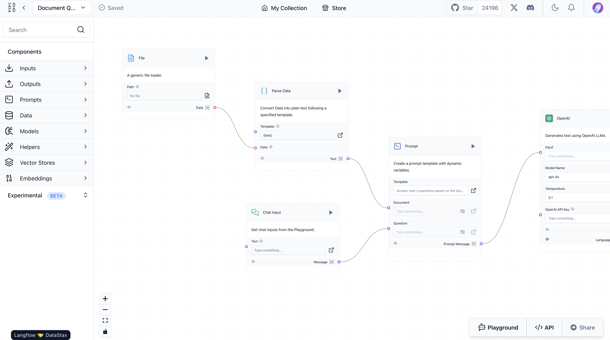
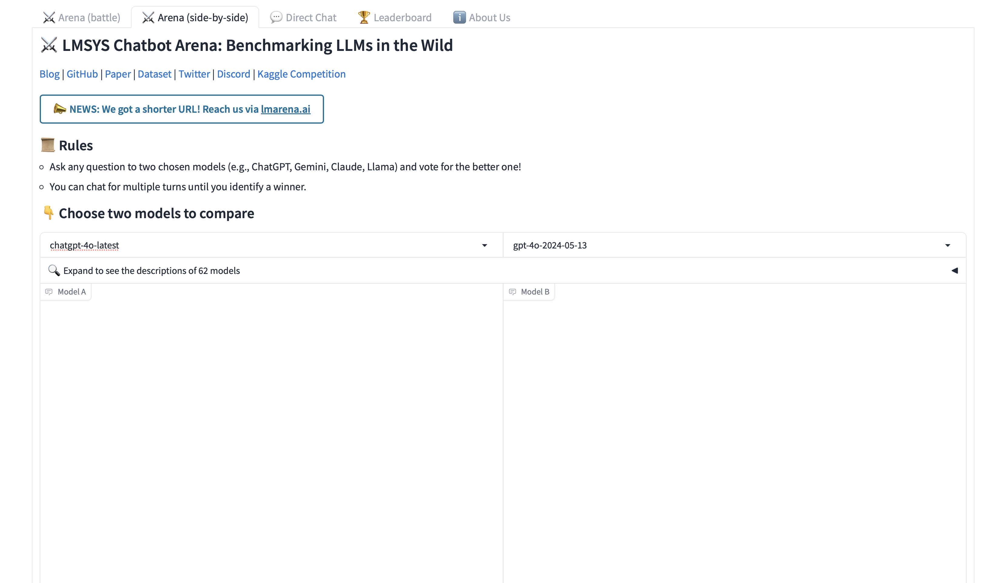
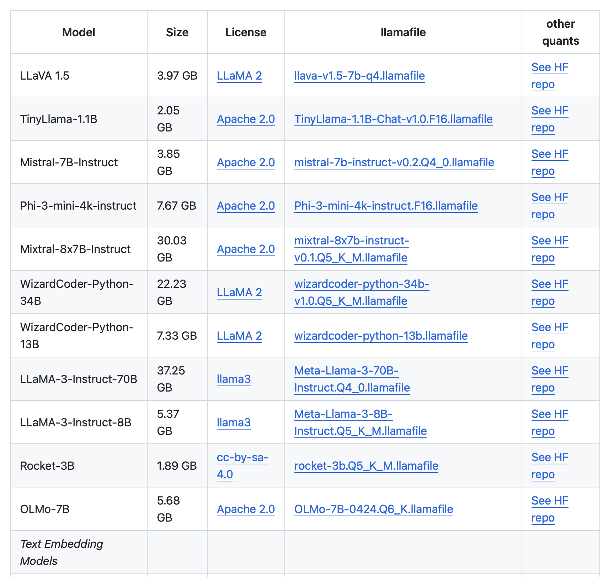
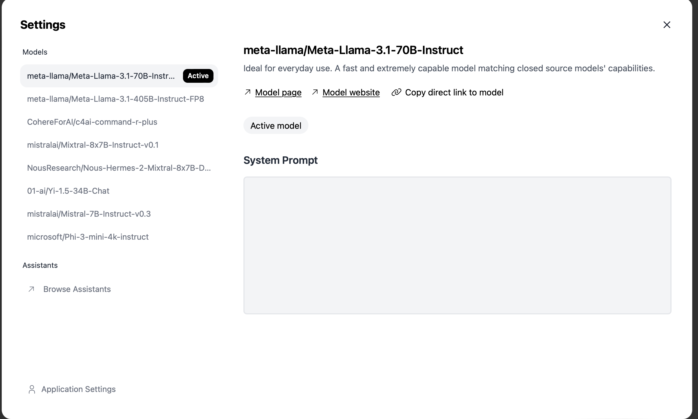
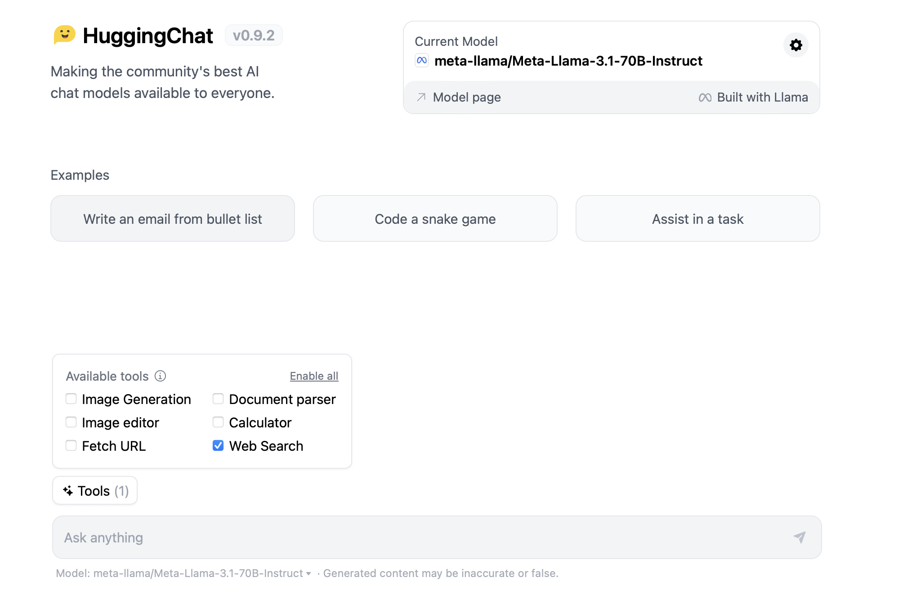

# GenAI for Everyone Class


----


## Data Analytics and AI Landscape

* PDF Version https://mattturck.com/landscape/mad2024.pdf
* Interactive Version https://mad.firstmark.com



## List of In Class Demos 

#### 1. HuggingFace and LangChain/LLamaIndex Colab Notebook

> You can find the notebook in the Code folder along with the Chinook SQLite database used. The notebook showcases how to use HuggingFace, LangChain, and LlamaIndex


#### 2. **LangFlow** (https://www.langflow.org)

> **LangFlow** is an open-source visual framework for building AI applications powered by large language models (LLMs) using LangChain. It provides a user-friendly, low-code approach to developing generative AI apps.

You can install LangFlow using 

```python
python -m pip install langflow -U
```

Then run

```python
python -m langflow run
```



#### 3. LMSYS Chatbot Arena (https://chat.lmsys.org)




#### 4. LLama File (https://github.com/Mozilla-Ocho/llamafile)

Demonstrated how you can download a model and run it locally on your machine 

> **Llamafile** is an innovative open-source project developed by Mozilla that simplifies the process of running large language models (LLMs) on personal computers. It encapsulates both the model weights and the necessary code to execute the model into a single multi-GB file, making it easier for users to deploy LLMs without extensive technical knowledge.



---

## List of Conversational LLMs similar to ChatGPT

#### 1. Google Gemini (https://gemini.google.com/app)

Showed how you can request verification of content 

#### 2. Mistral AI (https://chat.mistral.ai/chat)

#### 3. HuggingChat (https://huggingface.co/chat/)

Showed how you can select different models and require web search





#### 4. Perplexity AI (https://www.perplexity.ai)

---

## Other Resources 

* Content Authenticity Org https://contentauthenticity.org

* EU AI Compliance Act https://artificialintelligenceact.eu

*  USA AI Compliance Act https://www.whitehouse.gov/ostp/ai-bill-of-rights/

  

